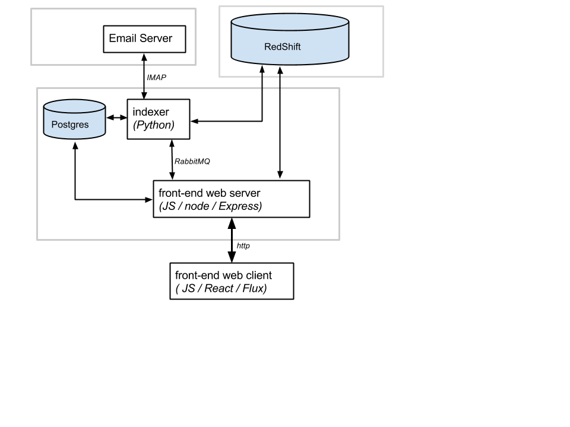

# Analytic Inbox

Analytic Inbox (ai) is a service for analysis and visualization of communication between people over electronic media such as email.

# Architecture

The Analytic Inbox service is shown here:

The light gray boxes indicate likely data center / WAN boundaries.
This diagram captures the basic structure but omits some essential details, such as OAuth authentication dependencies or use of S3 for loading files into RedShift.

The Postgres database stores metadata such as user accounts and preferences, and application data such as user-generated cleaned up contact data.

Redshift is the analytics data warehouse.

# Repository Structure

The folder structure of this repository reflects the architecture and is organized as follows:

- **doc/** - project documentation, screenshots, etc.
- **db/** - Setup and maintenance scripts for Postgres database
- **analytics_db/** -- Setup and maintenance scripts for analytics data warehouse
- **analytics_db/queries** --
- **indexer/** - The indexer service, responsible for transferring meta-data from an email server in to RedShift. 
- **frontend/** - The client and server components of the service front-end
- **frontend/server** - Web server front end
- **frontend/server/views** - HTML templates for static content
- **frontend/client** - JavaScript code for web client, built with React.js

# 
