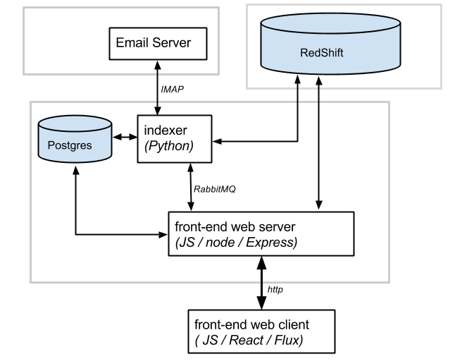

# Analytic Inbox

Analytic Inbox (ai) is a service for analysis and visualization of communication between people over electronic media such as email.

## Goals

We'd like to be able to perform analysis like:

   * Who do I correspond directly with the most?  What is a rank-ordered list of my top correspondents?
   * What does this pattern look like over time?  Who did I used to correspond with regularly that I haven’t been in touch with in a while?
   * In time series chart / metrics, show history of interactions with a correspondent, and original (non-quoted) lines of text in each message.
   * Who do I owe email to?
   * Who owes me email?
   * What URLs have I mailed to myself?  Can we make those searchable?
   * What URLs have been sent to me by close/important correspondents?
   * Among my correspondents, what is my average response time?  What percentage of emails do I reply to?  What are average response times for each of the people I correspond with?  How does this metric change over time?
   * For a given correspondent, who are 'adjacent correspondents' that appear on To/Cc line in our interactions.  How often / frequently do they appear?

# Architecture

The Analytic Inbox service is shown here:

The light gray boxes indicate likely data center / WAN boundaries.
This diagram captures the basic structure but omits some essential details, such as OAuth authentication dependencies or use of S3 for loading files into RedShift.

The Postgres database stores metadata such as user accounts and preferences, and application data such as user-generated cleaned up contact data.

Redshift is the analytics data warehouse.

# Repository Structure

The folder structure of this repository reflects the architecture and is organized as follows:

- **doc/** - project documentation, screenshots, etc.
- **db/** - Setup and maintenance scripts for Postgres database
- **analytics_db/** -- Setup and maintenance scripts for analytics data warehouse
- **analytics_db/queries** --
- **indexer/** - The indexer service, responsible for transferring meta-data from an email server in to RedShift. 
- **frontend/** - The client and server components of the service front-end
- **frontend/server** - Web server front end
- **frontend/server/views** - HTML templates for static content
- **frontend/client** - JavaScript code for web client, built with React.js

# Setup

### You will need the following installed locally:

- **Python 2.7.8** -
- **Node and npm** - Both of which can be downloaded from [nodejs.org](http://www.nodejs.org/).  **Note**: Some platforms (such as CentOS 6) unfortunately don't seem to include an up-to-date (>= 2.0.0) version of npm with the packaged binary distribution.  If this turns out to be the case, npm can be upgraded by running `npm install -g npm` after initial installation.
- **Postgres** - ?? version ?
- **RabbitMQ** - ?? version ?

### Setup Amazon RedShift

Follow the detailed instructions in [analytics_db/README.md](analytics_db/README.md).

### Setup Postgres

**TODO**: Walk through essential details, including creating user

